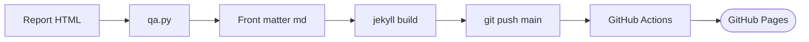

# whchoi98.github.io

[](https://github.com/whchoi98/whchoi98.github.io/actions/workflows/pages-deploy.yml)
[](https://jekyllrb.com/)
<a href="#english"></a>
<a href="#korean"></a>

AWS Solutions Architect's tech blog and workshop portal built on a custom Jekyll theme | 커스텀 Jekyll 테마로 만든 AWS Solutions Architect의 기술 블로그 겸 워크샵 포털

---

<a id="english"></a>

# English

## Overview

whchoi98.github.io is a static tech blog and hands-on workshop portal, served by GitHub Pages and built with a fully custom Jekyll theme.
Posts are self-contained "techblogs"-format HTML analysis documents rendered through an iframe-isolating report layout, so each document keeps its own typography, theme toggle, and code styling independent of the site chrome.
The site covers AWS, AIML, containers, networking, and Claude Code engineering, in both Korean and English.

## Features

- **Report pattern** — Each post is a front-matter-only Markdown file plus a self-contained report HTML; the `report` layout renders it in an isolated iframe with breadcrumb, print, and prev/next navigation.
- **Dual language (KO/EN)** — Site chrome switches instantly via `.l-ko`/`.l-en` span pairs and an `html.lang-en` toggle; report documents embed both Korean and English pages internally.
- **archify architecture maps** — Every post ships an interactive architecture map HTML and a PNG figure embedded inline in the report.
- **Mac terminal code blocks** — Report code blocks use a mac-terminal style with traffic-light buttons and a copy button.
- **Readability charter** — One claim per paragraph, short sentences, numbers in comparison blocks, hedged claims for n=1 data; facts are preserved over rhetoric.

## Architecture


See [docs/architecture.md](docs/architecture.md) for the full architecture document.

## Prerequisites

- Ruby 3.2+ (user-level gems at `~/.local/share/gem/ruby/3.2.0/bin`)
- bundler
- python3 (for the techblogs QA script)

## Installation

```bash
# Clone the repository
git clone https://github.com/whchoi98/whchoi98.github.io.git
cd whchoi98.github.io

# One-command setup (dependencies, .env, git hooks)
bash scripts/setup.sh
```

## Usage

```bash
# Build the site locally (pre-push verification)
PATH="$HOME/.local/share/gem/ruby/3.2.0/bin:$PATH" bundle exec jekyll build -d _site

# Serve locally at http://127.0.0.1:4000
PATH="$HOME/.local/share/gem/ruby/3.2.0/bin:$PATH" bundle exec jekyll serve

# Deploy: push to main and GitHub Actions publishes to Pages
git push origin main
```

## Project Structure

```
whchoi98.github.io/
  _config.yml        # Site config, category registry, build exclude list
  _layouts/          # 8 layouts (default, home, post, report, tags, listing, about, doc)
  _includes/         # topbar.html (nav + theme/language toggles)
  assets/            # main.css, main.js, category SVG icons
  docs/
    techblog/        # Posts: <slug>.md + <slug>-report.html + archmap per category
    workshop/        # 50+ hands-on workshop documents
    architecture.md  # Internal architecture doc (excluded from build)
    decisions/       # ADRs (excluded from build)
    runbooks/        # Operational runbooks (excluded from build)
    reference/       # Implementation references (excluded from build)
  index.md           # Home page
  tags.md, about.md  # Tag filter and about pages
  .claude/           # Claude Code settings, hooks, skills, commands, agents
  scripts/           # setup.sh, install-hooks.sh
  tests/             # Harness test suite (hooks, structure)
```

## Testing

```bash
# Harness test suite (hooks, secret patterns, site structure)
bash tests/run-all.sh

# techblogs QA for a single report
python3 ~/.claude/skills/techblogs/scripts/qa.py docs/techblog/<category>/<slug>-report.html
```

## Contributing

```
1. Fork the repository
2. Create your branch (git checkout -b feat/amazing-feature)
3. Commit changes (git commit -m 'feat: add amazing feature')
4. Push to the branch (git push origin feat/amazing-feature)
5. Open a Pull Request
```

Commit messages follow Conventional Commits (feat:, fix:, docs:). Never use `git add -A`; stage files explicitly.

## License

No open-source license file is provided. All content copyright the author (whchoi98); all rights reserved.

## Contact

- GitHub: [whchoi98](https://github.com/whchoi98)
- Issues: [github.com/whchoi98/whchoi98.github.io/issues](https://github.com/whchoi98/whchoi98.github.io/issues)
- Site: [whchoi98.github.io](https://whchoi98.github.io)

---

<a id="korean"></a>

# 한국어

## 개요

whchoi98.github.io는 GitHub Pages로 서비스되고 완전 커스텀 Jekyll 테마로 빌드되는 정적 기술 블로그 겸 핸즈온 워크샵 포털입니다.
게시물은 자립형 "techblogs" 형식 HTML 분석 문서이며, iframe 격리 방식의 report 레이아웃으로 렌더링되어 각 문서가 사이트 크롬과 독립적으로 자체 타이포그래피, 테마 토글, 코드 스타일을 유지합니다.
AWS, AIML, 컨테이너, 네트워킹, Claude Code 엔지니어링을 한국어와 영어로 다룹니다.

## 주요 기능

- **Report 패턴** — 게시물은 front matter 전용 Markdown 파일과 자립형 리포트 HTML의 쌍입니다. `report` 레이아웃이 격리된 iframe으로 렌더링하고 브레드크럼, 인쇄, 이전/다음 네비게이션을 제공합니다.
- **이중 언어 (KO/EN)** — 사이트 크롬은 `.l-ko`/`.l-en` 스팬 쌍과 `html.lang-en` 토글로 즉시 전환됩니다. 리포트 문서는 내부에 한국어/영어 페이지를 모두 내장합니다.
- **archify 아키텍처 맵** — 모든 게시물에 인터랙티브 아키텍처 맵 HTML과 리포트에 인라인 삽입되는 PNG figure가 포함됩니다.
- **Mac 터미널 코드블록** — 리포트 코드블록은 신호등 버튼과 복사 버튼이 있는 mac 터미널 스타일을 사용합니다.
- **가독성 헌장** — 한 문단 하나의 주장, 짧은 문장, 수치는 비교 블록으로, n=1 데이터는 헤지 표현으로. 수사보다 사실 보존이 우선입니다.

## 아키텍처



전체 아키텍처 문서는 [docs/architecture.md](docs/architecture.md)를 참조합니다.

## 사전 요구 사항

- Ruby 3.2+ (사용자 gem 경로: `~/.local/share/gem/ruby/3.2.0/bin`)
- bundler
- python3 (techblogs QA 스크립트용)

## 설치 방법

```bash
# 저장소 클론
git clone https://github.com/whchoi98/whchoi98.github.io.git
cd whchoi98.github.io

# 원커맨드 셋업 (의존성, .env, git hooks)
bash scripts/setup.sh
```

## 사용법

```bash
# 로컬 빌드 (push 전 검증)
PATH="$HOME/.local/share/gem/ruby/3.2.0/bin:$PATH" bundle exec jekyll build -d _site

# 로컬 서버 (http://127.0.0.1:4000)
PATH="$HOME/.local/share/gem/ruby/3.2.0/bin:$PATH" bundle exec jekyll serve

# 배포: main push 시 GitHub Actions가 Pages에 게시
git push origin main
```

## 프로젝트 구조

```
whchoi98.github.io/
  _config.yml        # 사이트 설정, 카테고리 레지스트리, 빌드 exclude 목록
  _layouts/          # 레이아웃 8종 (default, home, post, report, tags, listing, about, doc)
  _includes/         # topbar.html (네비 + 테마/언어 토글)
  assets/            # main.css, main.js, 카테고리 SVG 아이콘
  docs/
    techblog/        # 게시물: 카테고리별 <slug>.md + <slug>-report.html + archmap
    workshop/        # 핸즈온 워크샵 문서 50여 개
    architecture.md  # 내부 아키텍처 문서 (빌드 제외)
    decisions/       # ADR (빌드 제외)
    runbooks/        # 운영 런북 (빌드 제외)
    reference/       # 구현 레퍼런스 (빌드 제외)
  index.md           # 홈 페이지
  tags.md, about.md  # 태그 필터, 소개 페이지
  .claude/           # Claude Code 설정, 훅, 스킬, 커맨드, 에이전트
  scripts/           # setup.sh, install-hooks.sh
  tests/             # 하네스 테스트 스위트 (훅, 구조)
```

## 테스트

```bash
# 하네스 테스트 스위트 (훅, 시크릿 패턴, 사이트 구조)
bash tests/run-all.sh

# 단일 리포트 techblogs QA
python3 ~/.claude/skills/techblogs/scripts/qa.py docs/techblog/<category>/<slug>-report.html
```

## 기여 방법

```
1. Fork the repository
2. Create your branch (git checkout -b feat/amazing-feature)
3. Commit changes (git commit -m 'feat: add amazing feature')
4. Push to the branch (git push origin feat/amazing-feature)
5. Open a Pull Request
```

커밋 메시지는 Conventional Commits(feat:, fix:, docs:)를 따릅니다. `git add -A`는 사용하지 않고 파일을 명시적으로 스테이징합니다.

## 라이선스

오픈소스 라이선스 파일은 제공되지 않습니다. 모든 콘텐츠의 저작권은 저자(whchoi98)에게 있습니다.

## 연락처

- GitHub: [whchoi98](https://github.com/whchoi98)
- Issues: [github.com/whchoi98/whchoi98.github.io/issues](https://github.com/whchoi98/whchoi98.github.io/issues)
- Site: [whchoi98.github.io](https://whchoi98.github.io)
