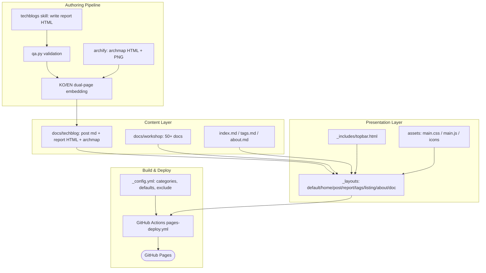
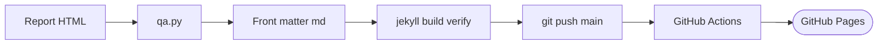

# Architecture

---

# English

## System Overview

whchoi98.github.io is a Jekyll 4.3 static blog with a fully custom theme, deployed to GitHub Pages via GitHub Actions.
Posts are self-contained "techblogs"-format HTML documents (KO/EN dual pages embedded) rendered through an iframe-isolating `report` layout, with front-matter-only Markdown files acting as routing containers.
The primary flow: author writes a report HTML, QA validates it, a push to main triggers Actions, and Pages serves the built site.

## Components

### Content Layer
- **docs/techblog/<category>/** -- One directory per category (aiml, aws-core, cloud-security, container, observability, networking, database, data-analytics). Each post is a triple: `<slug>.md` (front matter only: layout report, report_src, title/title_en, date, category, tags, excerpt/excerpt_en), `<slug>-report.html` (self-contained analysis document), and `<slug>-archmap.html` + `.png` (archify architecture map).
- **docs/workshop/** -- 50+ hands-on workshop documents rendered with the `doc` layout (sidebar navigation). Layout is applied via `_config.yml` defaults, not per-file front matter.
- **index.md / tags.md / about.md** -- Root pages using `home`, `tags`, and `about` layouts.
- **docs/decisions|runbooks|reference/, docs/architecture.md, docs/onboarding.md** -- Internal docs, excluded from the Jekyll build by `_config.yml` exclude.

### Presentation Layer
- **_layouts/** -- Eight layouts: `default` (skeleton, pre-paint theme/language script), `home`, `post`, `report` (iframe-isolated post rendering), `tags`, `listing`, `about`, `doc`.
- **_includes/topbar.html** -- Top navigation with theme (dark/light) and language (KO/EN) toggles.
- **assets/css/main.css** -- Single stylesheet; CSS variables on `:root` with `html.dark` overrides.
- **assets/js/main.js** -- Vanilla JS: theme toggle, language toggle (`html.lang-en` + `.l-ko`/`.l-en` spans), home search, tag filter, table of contents. State persists in localStorage.
- **assets/icons/** -- Category SVG icons; filenames match `blog_categories[].icon` in `_config.yml`.

### Build & Deploy Layer
- **_config.yml** -- Site metadata, category registry (`blog_categories`), path-based layout defaults, and the exclude list that keeps internal docs out of the public site.
- **.github/workflows/pages-deploy.yml** -- On push to main: checkout, Ruby 3.3 setup with bundler cache, `bundle exec jekyll build`, upload artifact, deploy to GitHub Pages.
- **Local build** -- `PATH="$HOME/.local/share/gem/ruby/3.2.0/bin:$PATH" bundle exec jekyll build -d _site` for pre-push verification.

### Authoring Pipeline Layer
- **Write** -- techblogs skill produces the self-contained report HTML (stat blocks, TL;DR, callouts, mac-terminal code blocks, embedded theme toggle).
- **Validate** -- `python3 ~/.claude/skills/techblogs/scripts/qa.py <report.html>` enforces structural/style rules (exit 1 on ERROR).
- **Translate** -- KO/EN dual pages are embedded in the same report HTML; front matter carries `title_en`/`excerpt_en`.
- **Diagram** -- archify skill generates the interactive archmap HTML and PNG export embedded as an inline figure.

## Full Architecture Diagram

## Data Flow Summary

Publishing a post - the critical path:

## Infrastructure

### Hosting
- GitHub Pages (github.io), built by GitHub Actions on ubuntu-latest with Ruby 3.3

### Resources
| Component | Resource | Description |
|-----------|----------|-------------|
| Repository | github.com/whchoi98/whchoi98.github.io | Source of truth; main push = deploy |
| CI/CD | .github/workflows/pages-deploy.yml | Build (jekyll) + deploy (actions/deploy-pages) |
| Site | https://whchoi98.github.io | Public site, pretty permalinks |

## Key Design Decisions

- **Report iframe isolation** -- The `report` layout embeds each self-contained report HTML in an iframe instead of inlining it. Report documents carry their own full CSS/JS (fonts, theme, terminal code blocks); inlining them would collide with the site stylesheet and force every report to conform to site chrome. The iframe keeps both stylesheets sovereign at the cost of a scroll/height bridge.
- **docs/ content conventions** -- All public content lives under `docs/` (`techblog` per-category triples, `workshop` flat docs), while internal docs share the same `docs/` tree but are excluded via `_config.yml`. One tree for humans, one exclude list for the build - no separate private repo needed.
- **Dual-language mechanism** -- Site chrome switches KO/EN by toggling `html.lang-en` and showing `.l-ko`/`.l-en` span pairs (no page reload, no duplicate routes); report documents embed both language pages internally. This trades some payload size for zero routing complexity and a single canonical URL per post.
- **Canonical URLs** -- Each report HTML declares `<link rel="canonical">` pointing to the post's pretty URL (`/docs/techblog/<category>/<slug>/`), so search engines index the framed post page, not the raw report file that is also directly reachable.
- **site.pages over _posts collection** -- Posts are ordinary pages sorted by `date` front matter, keeping category directories as plain folders and permalinks fully path-derived.

## Operations
- Deployment: verified local build, then push to main (see `.claude/commands/deploy.md`)
- Runbooks: see [docs/runbooks/](runbooks/) (template: `.template.md`)

---

# 한국어

## 시스템 개요

whchoi98.github.io는 완전 커스텀 테마의 Jekyll 4.3 정적 블로그이며, GitHub Actions를 통해 GitHub Pages에 배포됩니다.
게시물은 자립형 "techblogs" 형식 HTML 문서(KO/EN 이중 페이지 내장)로, iframe 격리 방식의 `report` 레이아웃을 통해 렌더링되며, front matter만 담은 Markdown 파일이 라우팅 컨테이너 역할을 합니다.
핵심 흐름: 리포트 HTML 작성 → QA 검증 → main push → Actions 빌드 → Pages 서빙입니다.

## 구성요소

### Content Layer
- **docs/techblog/<카테고리>/** -- 카테고리별 디렉토리 (aiml, aws-core, cloud-security, container, observability, networking, database, data-analytics). 게시물은 3종 세트입니다: `<slug>.md`(front matter 전용: layout report, report_src, title/title_en, date, category, tags, excerpt/excerpt_en), `<slug>-report.html`(자립형 분석 문서), `<slug>-archmap.html` + `.png`(archify 아키텍처 맵).
- **docs/workshop/** -- `doc` 레이아웃(사이드바 네비게이션)으로 렌더링되는 핸즈온 워크샵 문서 50여 개. 레이아웃은 파일별 front matter가 아닌 `_config.yml` defaults로 적용됩니다.
- **index.md / tags.md / about.md** -- `home`, `tags`, `about` 레이아웃을 쓰는 루트 페이지.
- **docs/decisions|runbooks|reference/, docs/architecture.md, docs/onboarding.md** -- 내부 문서. `_config.yml` exclude로 Jekyll 빌드에서 제외됩니다.

### Presentation Layer
- **_layouts/** -- 레이아웃 8종: `default`(골격, 첫 페인트 전 테마/언어 스크립트), `home`, `post`, `report`(iframe 격리 게시물 렌더링), `tags`, `listing`, `about`, `doc`.
- **_includes/topbar.html** -- 테마(다크/라이트)와 언어(KO/EN) 토글이 있는 상단 네비게이션.
- **assets/css/main.css** -- 단일 스타일시트. `:root` CSS 변수 + `html.dark` 오버라이드.
- **assets/js/main.js** -- Vanilla JS: 테마 토글, 언어 토글(`html.lang-en` + `.l-ko`/`.l-en` 스팬), 홈 검색, 태그 필터, 목차. 상태는 localStorage에 저장됩니다.
- **assets/icons/** -- 카테고리 SVG 아이콘. 파일명이 `_config.yml`의 `blog_categories[].icon` 값과 일치합니다.

### Build & Deploy Layer
- **_config.yml** -- 사이트 메타데이터, 카테고리 레지스트리(`blog_categories`), 경로 기반 레이아웃 defaults, 내부 문서를 공개 사이트에서 배제하는 exclude 목록.
- **.github/workflows/pages-deploy.yml** -- main push 시: checkout, Ruby 3.3 + bundler 캐시, `bundle exec jekyll build`, 아티팩트 업로드, GitHub Pages 배포.
- **로컬 빌드** -- push 전 검증용: `PATH="$HOME/.local/share/gem/ruby/3.2.0/bin:$PATH" bundle exec jekyll build -d _site`

### Authoring Pipeline Layer
- **작성** -- techblogs 스킬이 자립형 리포트 HTML을 생성합니다 (통계 블록, TL;DR, 콜아웃, mac 터미널 코드블록, 테마 토글 내장).
- **검증** -- `python3 ~/.claude/skills/techblogs/scripts/qa.py <report.html>`이 구조/스타일 규칙을 강제합니다 (ERROR 시 exit 1).
- **번역** -- KO/EN 이중 페이지를 같은 리포트 HTML에 내장하고, front matter가 `title_en`/`excerpt_en`을 보유합니다.
- **다이어그램** -- archify 스킬이 인터랙티브 archmap HTML과 PNG를 생성하고, PNG는 인라인 figure로 리포트에 삽입됩니다.

## 전체 아키텍처 다이어그램

## 데이터 흐름 요약

글 게시의 크리티컬 패스:

## 인프라

### 호스팅
- GitHub Pages (github.io). GitHub Actions ubuntu-latest + Ruby 3.3으로 빌드

### 리소스
| 구성요소 | 리소스 | 설명 |
|-----------|----------|-------------|
| Repository | github.com/whchoi98/whchoi98.github.io | 단일 소스. main push가 곧 배포 |
| CI/CD | .github/workflows/pages-deploy.yml | 빌드(jekyll) + 배포(actions/deploy-pages) |
| Site | https://whchoi98.github.io | 공개 사이트, pretty permalink |

## 핵심 설계 결정

- **report iframe 격리** -- `report` 레이아웃은 자립형 리포트 HTML을 인라인이 아닌 iframe으로 삽입합니다. 리포트 문서는 자체 CSS/JS(폰트, 테마, 터미널 코드블록)를 온전히 갖고 있어, 인라인 삽입 시 사이트 스타일시트와 충돌하고 모든 리포트가 사이트 크롬에 종속됩니다. iframe은 스크롤/높이 브리지 비용을 치르는 대신 양쪽 스타일의 독립성을 보장합니다.
- **docs/ 적재 규약** -- 모든 공개 콘텐츠는 `docs/` 아래에 둡니다 (`techblog`는 카테고리별 3종 세트, `workshop`은 평면 문서). 내부 문서도 같은 `docs/` 트리를 공유하되 `_config.yml` exclude로 빌드에서 배제합니다. 사람에게는 하나의 트리, 빌드에는 하나의 exclude 목록 - 별도 비공개 저장소가 필요 없습니다.
- **이중 언어 메커니즘** -- 사이트 크롬은 `html.lang-en` 클래스 토글과 `.l-ko`/`.l-en` 스팬 쌍으로 KO/EN을 전환합니다 (페이지 리로드 없음, 중복 라우트 없음). 리포트 문서는 내부에 양 언어 페이지를 내장합니다. 페이로드가 다소 커지는 대신 라우팅 복잡도가 0이고 게시물당 canonical URL이 하나로 유지됩니다.
- **Canonical URL** -- 각 리포트 HTML은 `<link rel="canonical">`로 게시물의 pretty URL(`/docs/techblog/<카테고리>/<slug>/`)을 선언합니다. 직접 접근 가능한 리포트 원본 파일이 아니라 프레임된 게시물 페이지가 검색엔진에 색인되도록 하기 위함입니다.
- **_posts 컬렉션 대신 site.pages** -- 게시물은 `date` front matter로 정렬되는 일반 페이지입니다. 카테고리 디렉토리를 평범한 폴더로 유지하고 permalink를 경로에서 그대로 도출합니다.

## 운영
- 배포: 로컬 빌드 검증 후 main push (`.claude/commands/deploy.md` 참조)
- 런북: [docs/runbooks/](runbooks/) 참조 (템플릿: `.template.md`)
